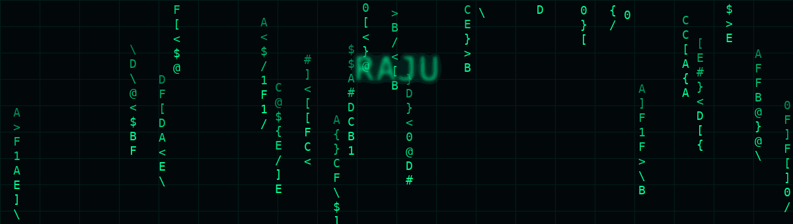

<div align="center">



<br><br>


# `RAJU`

### Full Stack Developer · Server Administrator · DevOps

**Building web applications • managing infrastructure • deploying secure systems**

<a href="https://github.com/rmdevops-sys">

</a>
<a href="https://rmdevops.in">

</a>
<a href="mailto:hello@rmdevops.in">

</a>

</div>

---

## 🟢 `whoami`

```text
┌──────────────────────────────────────────────────────────────┐
│  RAJU                                                        │
│  Full Stack Developer | Server Administrator | DevOps        │
│                                                              │
│  Web Development     ████████████████████                    │
│  Backend / APIs      ██████████████████                      │
│  Linux / VPS         ███████████████████                     │
│  Deployment / DevOps ██████████████████                      │
│  Security / Hardening █████████████████                      │
└──────────────────────────────────────────────────────────────┘
```

I build modern web applications and manage the infrastructure behind them — from Laravel/PHP development and APIs to Linux servers, deployment, optimization, security and automation.

---

## ⚡ `tech --stack`

### `FRONTEND`


### `BACKEND`


### `DEVOPS / INFRASTRUCTURE`


---

## 🛠️ `services --list`

| # | Service | Focus |
|---|---|---|
| `01` | Web Development | Modern responsive websites & applications |
| `02` | Laravel / PHP | Backend systems, dashboards & APIs |
| `03` | React | Interactive frontend applications |
| `04` | Server Administration | Linux, VPS & hosting infrastructure |
| `05` | DevOps | Deployment, automation & CI/CD |
| `06` | Security | Hardening, SSH, firewall & monitoring |
| `07` | APIs | Integrations & backend services |
| `08` | Optimization | Performance & production setup |

---

## 🚀 `featured-projects`

### 🟢 RM Services
Web development, hosting and digital solutions.

**Laravel · PHP · MySQL · JavaScript**

### 🔵 RMDevOps
Developer portfolio and administration solutions.

**Laravel · Tailwind CSS · Vite**

### 🟣 Wamigo
Modern admin dashboard/template work.

**Laravel · Tailwind CSS · JavaScript**

---

## 📊 `github --activity`

### Contribution Snake

The previous third-party activity graph and stats endpoints have been removed because they can return **`Invalid upstream response (402)`**.

The repository now includes a GitHub Action that generates the contribution animation from GitHub data:

<picture>
  <source media="(prefers-color-scheme: dark)" srcset="https://raw.githubusercontent.com/rmdevops-sys/rmdevops-sys/output/github-contribution-snake-dark.svg">
  <source media="(prefers-color-scheme: light)" srcset="https://raw.githubusercontent.com/rmdevops-sys/rmdevops-sys/output/github-contribution-snake.svg">
  
</picture>

---

## 🖥️ `current --focus`

```text
[+] Laravel application architecture
[+] Linux / VPS administration
[+] Production deployment
[+] Server security & hardening
[+] API integrations
[+] DevOps automation
[+] React + Tailwind interfaces
```

---

## 📡 `connect`

<div align="center">

**🌐 Portfolio**  
https://rmdevops.in

**🐙 GitHub**  
https://github.com/rmdevops-sys

**✉️ Email**  
hello@rmdevops.in

</div>

---

<div align="center">

```text
╔══════════════════════════════════════════════════════════════╗
║                                                              ║
║   CODE  →  DEPLOY  →  SECURE  →  AUTOMATE  →  GROW          ║
║                                                              ║
╚══════════════════════════════════════════════════════════════╝
```

### `Turning ideas into scalable web solutions.`

</div>
