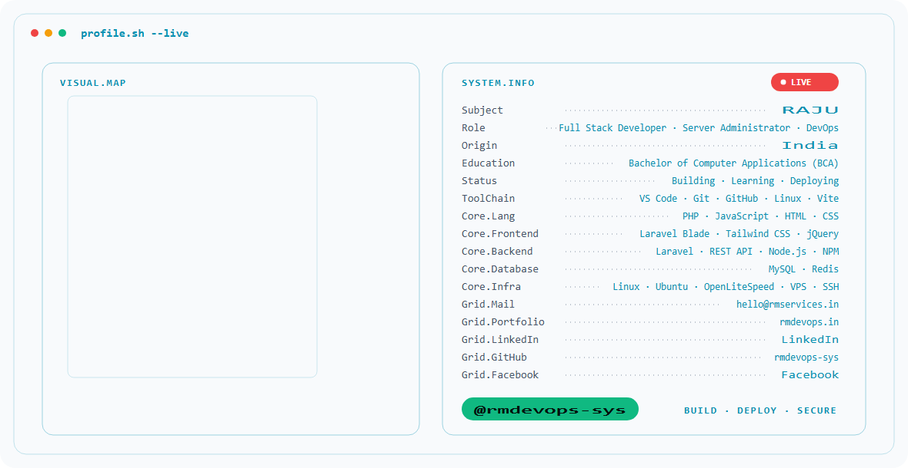

  <picture>
    <source media="(prefers-color-scheme: dark)" srcset="./assets/profile-banner-dark.gif">
    <source media="(prefers-color-scheme: light)" srcset="./assets/profile-banner-light.gif">
    
  </picture>

<h1 align="center">RAJU</h1>

  <strong>Full Stack Developer · Server Administrator · DevOps</strong>

Building · Learning · Deploying

---

## 👨‍💻 About Me

I'm RAJU, a Full Stack Developer, Server Administrator, and DevOps professional from India.

I build web applications, APIs, business systems, and deployment environments with a focus on practical development, automation, server management, and security.

- 🎓 Bachelor of Computer Applications (BCA)
- 🛠️ Full Stack Development
- 🖥️ Server Administration & Linux
- 🚀 DevOps, Deployment & Automation
- 🔐 Server Security, SSH, UFW, Fail2Ban & SSL/TLS

---

## ⚡ Tech Stack

### Languages
`PHP` `JavaScript` `HTML` `CSS`

### Frontend
`Laravel Blade` `Tailwind CSS` `jQuery` `Vite`

### Backend
`Laravel` `REST API` `Node.js` `NPM` `Composer`

### Database
`MySQL` `Redis`

### Infrastructure
`Linux` `Ubuntu` `Apache` `OpenLiteSpeed` `VPS` `SSH` `UFW` `Fail2Ban` `SSL/TLS` `Cron` `Bash`

### DevOps
`Git` `GitHub` `CI/CD` `Deployment` `Automation` `Server Security`

---

## 📊 GitHub Statistics

<!-- Phase 2: self-hosted github-readme-stats will be added here. -->

---

## 🐍 Contribution Activity

<!-- Phase 3: animated contribution snake will be added here. -->

---

## 🌐 Connect

  &nbsp;&nbsp;
  

---

  Built with code, curiosity, and continuous deployment.

