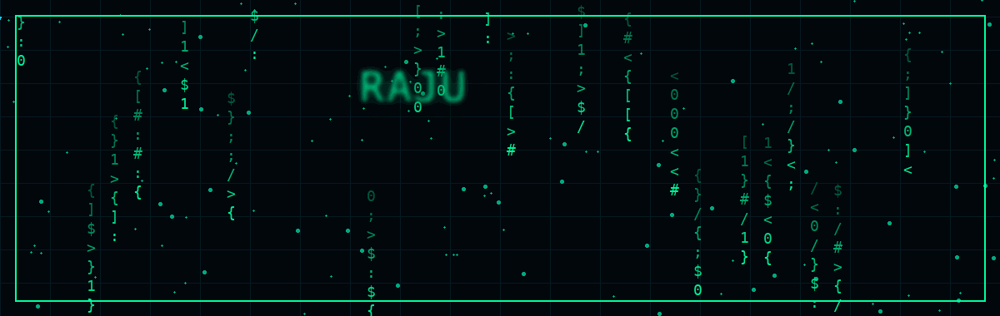
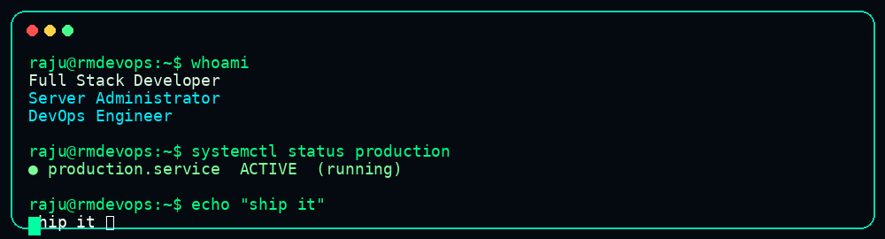

<div align="center">



<br><br>


# RAJU

### Full Stack Developer · Server Administrator · DevOps

<p>
<a href="https://github.com/rmdevops-sys"></a>
<a href="https://rmdevops.in"></a>
<a href="mailto:hello@rmdevops.in"></a>
</p>

**BUILD** · **DEPLOY** · **SECURE** · **AUTOMATE**

</div>

---



## 🟢 `01 // PROFILE`

<table>
<tr>
<td width="50%">

### Who I am

I build modern web applications and the infrastructure behind them, working across backend development, frontend interfaces, Linux/VPS administration, deployment, APIs, security and automation.

</td>
<td width="50%">

### What I work with

**Laravel · PHP · React · JavaScript · Tailwind CSS · MySQL · Node.js · Linux · Git · Docker · OpenLiteSpeed**

</td>
</tr>
</table>

---

## ⚡ `02 // STACK`

<table>
<tr>
<td valign="top" width="33%">

### FRONTEND


</td>
<td valign="top" width="33%">

### BACKEND


</td>
<td valign="top" width="33%">

### DEVOPS


</td>
</tr>
</table>

---

## 🛠️ `03 // WHAT I BUILD`

| | |
|---|---|
| 🌐 **Web Applications** — Modern responsive products and business systems. | ⚙️ **Backend & APIs** — Laravel/PHP systems, APIs and integrations. |
| 🖥️ **Server Administration** — Linux, VPS, hosting and production infrastructure. | 🛡️ **Security** — SSH, firewall, hardening and monitoring. |
| 🚀 **DevOps** — Deployment, automation and CI/CD workflows. | ⚡ **Performance** — Production optimization and reliable services. |

---

## 🚀 `04 // FEATURED PROJECTS`

<table>
<tr>
<td width="33%" valign="top">

### 🔵 RMDevOps

Developer portfolio and administration solutions.

`Laravel` `Tailwind` `Vite`

<a href="https://rmdevops.in">VISIT →</a>

</td>
<td width="33%" valign="top">

### 🟣 Wamigo

Modern admin dashboard/template work.

`Laravel` `Tailwind` `JavaScript`

</td>
</tr>
</table>

---

## 📊 `05 // GITHUB`

<div align="center">

<picture>
<source media="(prefers-color-scheme: dark)" srcset="https://raw.githubusercontent.com/rmdevops-sys/rmdevops-sys/output/github-contribution-snake-dark.svg">
<source media="(prefers-color-scheme: light)" srcset="https://raw.githubusercontent.com/rmdevops-sys/rmdevops-sys/output/github-contribution-snake.svg">

</picture>

</div>

---

## 🖥️ `06 // CURRENT FOCUS`

```text
┌─────────────────────────────────────────────────────────────┐
│  > Laravel architecture                                     │
│  > Linux / VPS infrastructure                               │
│  > Production deployment                                    │
│  > Server security & hardening                              │
│  > API integrations                                         │
│  > DevOps automation                                        │
│  > React + Tailwind interfaces                              │
└─────────────────────────────────────────────────────────────┘
```

---

## 📡 `07 // CONNECT`

<div align="center">

<a href="https://github.com/rmdevops-sys">GitHub</a>
&nbsp; • &nbsp;
<a href="https://rmdevops.in">Portfolio</a>
&nbsp; • &nbsp;
<a href="mailto:hello@rmdevops.in">hello@rmdevops.in</a>

<br><br>

```text
CODE → DEPLOY → SECURE → AUTOMATE → GROW
```

### Turning ideas into scalable web solutions.

</div>
